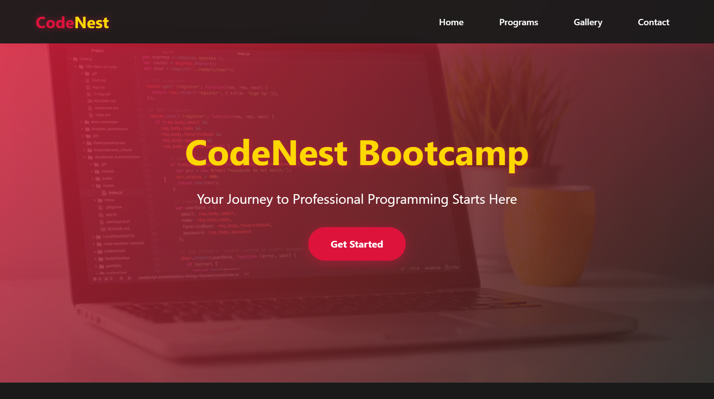
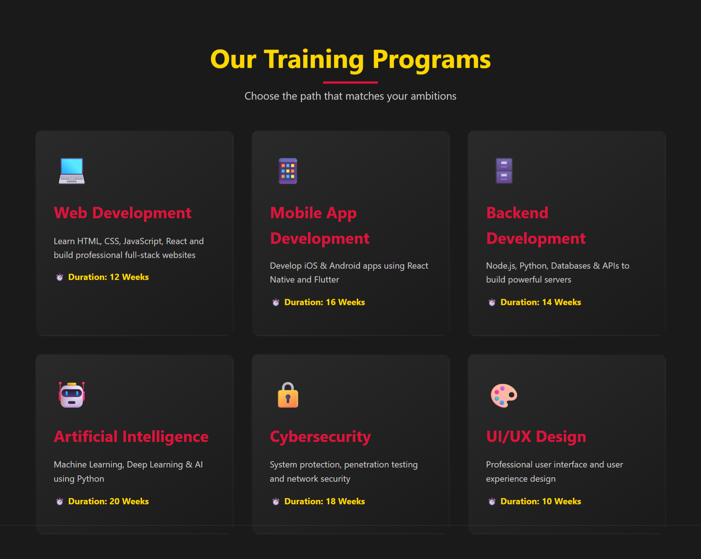
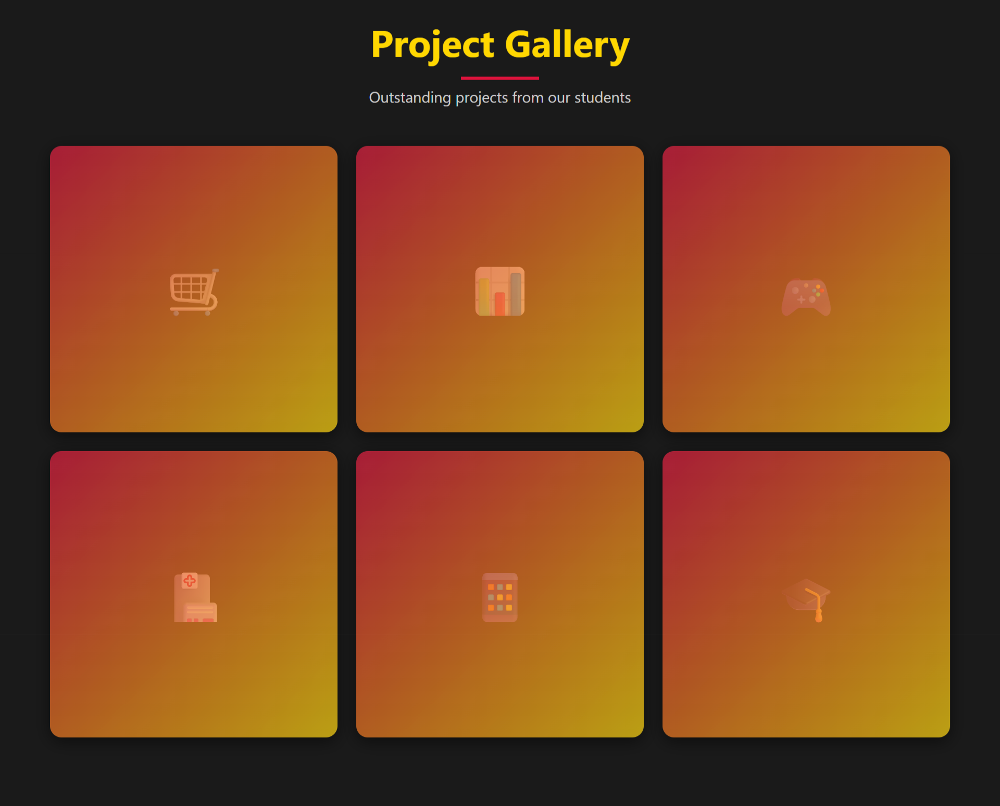
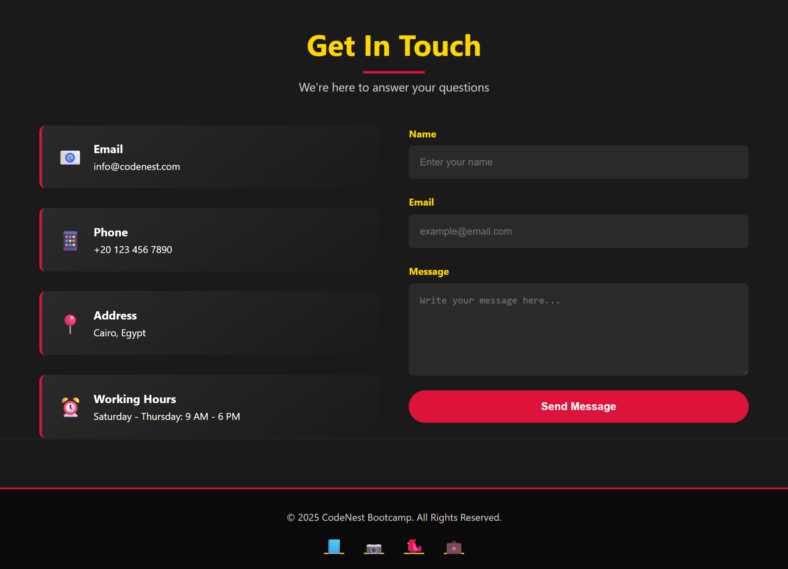

# 🚀 CodeNest Bootcamp - Professional Coding Academy




## 📋 Table of Contents

  - [Overview](#-overview)
  - [Features](#-features)
  - [Design System](#-design-system)
  - [Technologies Used](#-technologies-used)
  - [Project Structure](#-project-structure)
  - [Sections](#-sections)
  - [Responsive Design](#-responsive-design)
  - [Installation](#-installation)
  - [Usage](#-usage)
  - [Customization](#-customization)
  - [Browser Support](#-browser-support)
  - [Performance](#-performance)
  - [Contributing](#-contributing)
  - [License](#-license)
  - [Contact](#-contact)

-----

## 🎯 Overview

**CodeNest Bootcamp** is a modern, professional single-page website designed for a coding bootcamp academy. The website features a sleek design with an elegant color palette of **Crimson Red**, **Gold**, and **Matte Black**, creating a premium and engaging user experience.

### ✨ Key Highlights

  - 🎨 **Modern UI/UX Design** - Clean, professional interface
  - 📱 **Fully Responsive** - Works seamlessly on all devices
  - ⚡ **Interactive Elements** - Smooth animations and hover effects
  - 🎯 **User-Centric** - Easy navigation and clear call-to-actions
  - 🚀 **Performance Optimized** - Fast loading and smooth scrolling
  - 🌍 **Bilingual Support** - Full support for English (LTR) and Arabic (RTL).

-----

## 🌟 Features

### Core Features

  - ✅ **Fixed Navigation Bar** with smooth scroll behavior
  - ✅ **Language Switcher** - Toggle between English (LTR) and Arabic (RTL) versions.
  - ✅ **Hero Section** with background image and parallax effect
  - ✅ **Interactive Program Cards** with hover animations
  - ✅ **Project Gallery** with overlay effects
  - ✅ **Contact Form** with validation
  - ✅ **Mobile Hamburger Menu** for small screens
  - ✅ **Scroll Animations** - Elements fade in on scroll
  - ✅ **Social Media Links** in footer (using Font Awesome)

### Interactive Elements

  - 🎭 Smooth scroll to sections
  - 🌊 Parallax hero background
  - ✨ Card hover effects with transforms
  - 🎨 Gradient overlays
  - 📍 Active navigation highlighting
  - 💫 Pulse animations

-----

## 🎨 Design System

### Color Palette

```css
Primary Colors:
- Crimson Red: #DC143C
- Gold: #FFD700
- Matte Black: #1a1a1a
- Light Gray: #f5f5f5

Gradients:
- Hero Overlay: linear-gradient(135deg, rgba(220,20,60,0.85), rgba(26,26,26,0.85))
- Card Background: linear-gradient(145deg, #2a2a2a, #1a1a1a)
- Interactive Overlay: linear-gradient(135deg, var(--crimson), var(--gold))
```

### Typography

```css
Font Family: 'Segoe UI', Tahoma, Geneva, Verdana, sans-serif
Line Height: 1.6

Font Sizes:
- Hero Title: 4rem (2.5rem on mobile)
- Section Titles: 3rem (2rem on mobile)
- Hero Text: 1.5rem (1.2rem on mobile)
- Card Titles: 1.8rem
- Body Text: 1rem
```

### Spacing System

```css
Section Padding: 5rem 5%
Card Padding: 2rem
Gap Between Elements: 2rem
Border Radius: 8px - 50px (depending on element)
```

-----

## 💻 Technologies Used

| Technology | Purpose |
|-----------|---------|
| **HTML5** | Semantic markup structure |
| **CSS3** | Styling and animations |
| **JavaScript (Vanilla)** | Interactivity and DOM manipulation |
| **Font Awesome** | Social media icons |
| **Unsplash API** | Hero section background image |
| **Intersection Observer API** | Scroll animations |
| **CSS Grid & Flexbox** | Responsive layouts |

-----

## 📁 Project Structure

```
codenest-bootcamp/
│
├── index.html           # Main HTML file (English LTR)
├── index-ar.html        # Arabic HTML file (RTL)
│
├── style.css            # Main stylesheet (for LTR)
├── style-rtl.css        # RTL override stylesheet
│
├── script.js            # Main JavaScript file
├── README.md            # Project documentation
├── LICENSE              # Project license
│
└── screens/             # Folder for screenshots
    ├── 1.png
    ├── 2.png
    ├── 3.png
    └── 4.png
```

-----

## 📑 Sections

### 1\. 🏠 Home (Hero Section)

  - **Purpose**: First impression and main call-to-action
  - **Features**:
      - Full-screen hero with background image
      - Animated headline and subtitle
      - CTA button with hover effects
      - Parallax scrolling effect
  - **Content**: Brand name, tagline, and "Get Started" button

### 2\. 📚 Programs (Menu Section)

  - **Purpose**: Showcase available training programs
  - **Features**:
      - Grid layout with 6 program cards
      - Hover animations with color transitions
      - Icon representation for each program
      - Duration information
  - **Programs Included**:
      - 💻 Web Development (12 weeks)
      - 📱 Mobile App Development (16 weeks)
      - 🗄️ Backend Development (14 weeks)
      - 🤖 Artificial Intelligence (20 weeks)
      - 🔒 Cybersecurity (18 weeks)
      - 🎨 UI/UX Design (10 weeks)

### 3\. 🖼️ Gallery (Projects Section)

  - **Purpose**: Display student projects and achievements
  - **Features**:
      - Interactive grid layout
      - Gradient overlays on hover
      - Project descriptions reveal on hover
      - Visual hierarchy with icons
  - **Projects Showcased**:
      - 🛒 E-Commerce Store
      - 📊 Management System (ERP)
      - 🎮 Interactive Game
      - 🏥 Medical App
      - 📱 Delivery App
      - 🎓 Learning Platform (LMS)

### 4\. 📞 Contact (Contact Section)

  - **Purpose**: Enable visitor communication
  - **Features**:
      - Two-column layout (info + form)
      - Contact information cards
      - Functional contact form
      - Form validation
      - Hover effects on contact cards
  - **Information Provided**:
      - 📧 Email
      - 📱 Phone
      - 📍 Address
      - ⏰ Working Hours

### 5\. 🦶 Footer

  - **Purpose**: Additional information and social links
  - **Features**:
      - Copyright information
      - Social media icons (Font Awesome)
      - Crimson border accent
  - **Social Platforms**: Facebook, Instagram, Twitter, LinkedIn

-----

## 📱 Responsive Design

### Breakpoints

```css
Desktop: > 768px (3-column grid for programs/gallery)
Tablet: 768px (2-column grid, adjusted spacing)
Mobile: < 768px (1-column, hamburger menu)
```

### Mobile Optimizations

  - ✅ Hamburger menu for navigation
  - ✅ Single-column layouts
  - ✅ Reduced font sizes
  - ✅ Touch-friendly button sizes (min 44x44px)
  - ✅ Optimized images
  - ✅ Vertical stacking of contact section

### Tablet Optimizations

  - ✅ 2-column grid where appropriate
  - ✅ Adjusted padding and margins
  - ✅ Flexible navigation

-----

## 🚀 Installation

### Quick Start

1.  **Clone the repository**

<!-- end list -->

```bash
git clone https://github.com/yourusername/codenest-bootcamp.git
```

2.  **Navigate to project directory**

<!-- end list -->

```bash
cd codenest-bootcamp
```

3.  **Open in browser**

<!-- end list -->

```bash
# Simply open index.html in your browser
# or use a local server:
python -m http.server 8000
# or
npx http-server
```

4.  **View the website**

<!-- end list -->

```
Open: http://localhost:8000
```

### No Build Process Required

This is a static website with no dependencies or build tools needed\!

-----

## 🎮 Usage

### Navigation

  - Click on navigation links to smoothly scroll to sections.
  - Click the "عربي" or "English" button in the navigation bar to switch between languages.
  - Mobile users can tap the hamburger menu (☰) to access navigation.
  - All links are keyboard accessible.

### Interactive Elements

  - **Program Cards**: Hover to see elevation effect
  - **Gallery Items**: Hover to reveal project details
  - **Contact Form**: Fill and submit to send a message
  - **Buttons**: All buttons have hover states

### Form Submission

Currently configured with a JavaScript alert. To connect to a backend:

```javascript
// Replace in handleSubmit function:
async function handleSubmit(e) {
    e.preventDefault();
    const formData = new FormData(e.target);
    
    // Send to your backend
    await fetch('YOUR_API_ENDPOINT', {
        method: 'POST',
        body: formData
    });
}
```

-----

## 🎨 Customization

### Changing Colors

Edit CSS variables in the `:root` selector in `style.css`:

```css
:root {
    --crimson: #DC143C;      /* Change primary color */
    --gold: #FFD700;         /* Change accent color */
    --matte-black: #1a1a1a;  /* Change background */
}
```

### Changing Content

Edit HTML content directly in `index.html` (for English) and `index-ar.html` (for Arabic).

```html
<h1>Your Bootcamp Name</h1>
<p>Your tagline here</p>

<h3>Your Program Name</h3>
<p>Your program description</p>
```

### Adding New Programs

Copy and paste a program card in both HTML files:

```html
<div class="program-card">
    <div class="program-icon">🎯</div>
    <h3>New Program</h3>
    <p>Description here</p>
    <p class="duration">⏱️ Duration: X Weeks</p>
</div>
```

### Changing Hero Image

Replace the Unsplash URL in the CSS (`style.css`):

```css
.hero {
    background: linear-gradient(...), 
                url('YOUR_IMAGE_URL');
}
```

-----

## 🌐 Browser Support

| Browser | Version | Support |
|---------|---------|---------|
| Chrome | 90+ | ✅ Full |
| Firefox | 88+ | ✅ Full |
| Safari | 14+ | ✅ Full |
| Edge | 90+ | ✅ Full |
| Opera | 76+ | ✅ Full |
| Mobile Safari | iOS 14+ | ✅ Full |
| Chrome Mobile | 90+ | ✅ Full |

### Features Used

  - CSS Grid & Flexbox
  - CSS Custom Properties (Variables)
  - Intersection Observer API
  - CSS Animations & Transitions
  - backdrop-filter (with fallbacks)

-----

## ⚡ Performance

### Optimization Techniques

  - ✅ **Minimal Dependencies**: Pure HTML/CSS/JS
  - ✅ **Lazy Loading**: Images load as needed
  - ✅ **CSS Animations**: Hardware-accelerated transforms
  - ✅ **Efficient Selectors**: Optimized CSS
  - ✅ **Minification Ready**: Code can be minified
  - ✅ **CDN Images**: Using Unsplash CDN
  - ✅ **CDN Icons**: Using Font Awesome CDN

### Performance Metrics (Target)

  - First Contentful Paint: \< 1.5s
  - Time to Interactive: \< 2.5s
  - Lighthouse Score: 90+

### Best Practices Implemented

  - Semantic HTML5
  - Accessible navigation (ARIA labels where needed)
  - SEO-friendly structure
  - Mobile-first approach
  - Progressive enhancement

-----

## 🤝 Contributing

We welcome contributions\! Here's how you can help:

### Contribution Guidelines

1.  **Fork the repository**
2.  **Create a feature branch**
    ```bash
    git checkout -b feature/AmazingFeature
    ```
3.  **Commit your changes**
    ```bash
    git commit -m 'Add some AmazingFeature'
    ```
4.  **Push to the branch**
    ```bash
    git push origin feature/AmazingFeature
    ```
5.  **Open a Pull Request**

### Areas for Contribution

  - 🐛 Bug fixes
  - ✨ New features
  - 📝 Documentation improvements
  - 🌍 More translations
  - 🎨 Design enhancements
  - ♿ Accessibility improvements

-----

## 📄 License

This project is licensed under the MIT License - see the [LICENSE](LICENSE) file for details.

```
MIT License

Copyright (c) 2025 CodeNest Bootcamp

Permission is hereby granted, free of charge, to any person obtaining a copy
of this software and associated documentation files (the "Software"), to deal
in the Software without restriction, including without limitation the rights
to use, copy, modify, merge, publish, distribute, sublicense, and/or sell
copies of the Software...
```

-----

## 📞 Contact

### CodeNest Bootcamp

  - 🌐 Website: [www.codenest.com](https://www.codenest.com)
  - 📧 Email: info@codenest.com

### Developer

  - 💼 LinkedIn: [@MinaRomany](https://www.linkedin.com/in/minaromany/)
  - 🐙 GitHub: [@MinaRomanyBoles](https://github.com/MinaRomanyBoles)

-----

## 🙏 Acknowledgments

  - **Unsplash** - For high-quality hero images
  - **Font Awesome** - For the social media icons
  - **Inspiration** - Modern bootcamp websites and landing pages
  - **Community** - Thanks to all contributors

-----

## 🗓️ Changelog

### Version 1.0.0 (2025-10-26)

  - ✨ Initial release
  - 🎨 Implemented full design system
  - 📱 Added responsive layouts
  - ⚡ Added scroll animations
  - 🌍 Created English version
  - 🇦🇪 Created Arabic (RTL) version
  - 📝 Added contact form
  - 🖼️ Implemented project gallery
  - 💻 Added 6 training programs

-----

## 🔮 Future Enhancements

### Planned Features

  - [ ] Blog section for articles and tutorials
  - [ ] Student testimonials carousel
  - [ ] Course registration system
  - [ ] Payment integration
  - [ ] Video introduction section
  - [ ] Live chat support
  - [ ] Newsletter subscription
  - [ ] Dark/Light mode toggle
  - [ ] Instructor profiles section
  - [ ] FAQ accordion
  - [ ] Success stories section

-----

## 📊 Project Stats

-----

## 🎯 SEO & Accessibility

### SEO Features

  - ✅ Semantic HTML5 tags
  - ✅ Meta descriptions
  - ✅ Proper heading hierarchy
  - ✅ Alt text for images
  - ✅ Fast loading time
  - ✅ Mobile-friendly

### Accessibility Features

  - ✅ ARIA labels where needed
  - ✅ Keyboard navigation
  - ✅ Sufficient color contrast
  - ✅ Focus indicators
  - ✅ Screen reader friendly
  - ✅ Touch-friendly tap targets

-----

\<div align="center"\>

### ⭐ Star this repository if you find it helpful\!

**Made with ❤️ by SimplifeEG Team**

[Report Bug](https://github.com/yourusername/codenest-bootcamp/issues) · [Request Feature](https://github.com/yourusername/codenest-bootcamp/issues)

\</div\>

-----

© 2025 CodeNest Bootcamp. All Rights Reserved.
